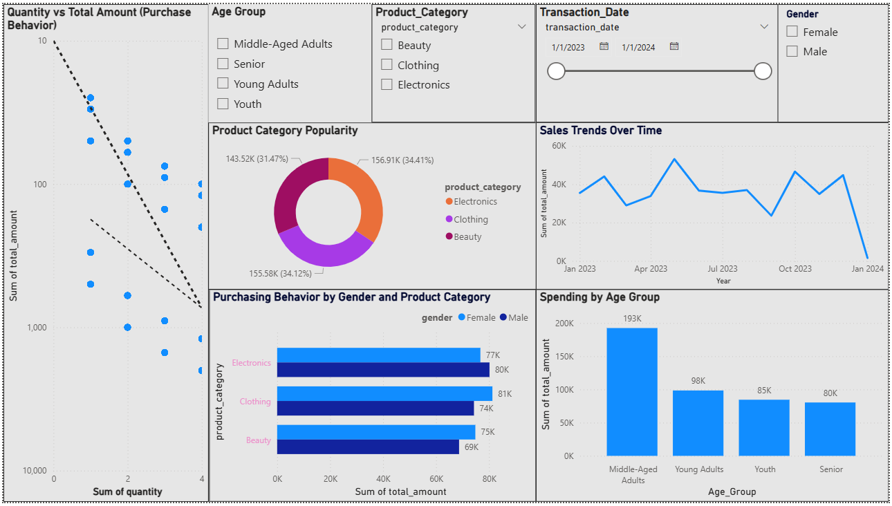

# Retail_Sales_Dashboard
Interactive Power BI dashboard analyzing retail customer behavior
# 🛍️ Retail Sales Dashboard (Power BI + SQL + Excel)

This project presents a comprehensive Exploratory Data Analysis (EDA) of customer behavior in a fictional retail environment using a synthetic dataset from Kaggle. The analysis was performed using **Power BI**, **MySQL**, and **Excel**, with a focus on uncovering insights into purchasing patterns, product preferences, and demographic trends.

---

## 📦 About the Dataset

This dataset simulates a real-world retail setting, combining customer demographics and transactional sales data. It contains:

- `Transaction ID`
- `Transaction Date`
- `Customer ID`
- `Gender`
- `Age`
- `Product Category`
- `Quantity`
- `Price per Unit`
- `Total Amount`

The dataset provides a rich basis for investigating customer behavior and retail operations through data-driven storytelling.

---

## 🔍 Questions Explored

This analysis addressed the following business questions:

1. **How does customer age and gender influence purchasing behavior?**
2. **Are there discernible patterns in sales across different time periods (monthly/seasonal)?**
3. **Which product categories hold the highest appeal among different customer segments?**
4. **What are the relationships between age, spending, and product preferences?**
5. **How do customers adapt their shopping habits during seasonal trends?**
6. **Are there distinct purchasing behaviors based on the number of items bought per transaction?**
7. **What insights can be gleaned from the distribution of product prices within each category?**

---

## 📊 Dashboard Features

- **Demographic Analysis**: Spend and quantity segmented by age group and gender
- **Time Series Trends**: Monthly and quarterly sales visualizations
- **Category Insights**: Total sales, quantity, and price distributions by product category
- **Age-Spending Relationship**: Visual correlation between customer age and spending
- **Quantity Behavior**: Scatter plot for Quantity vs. Total Amount
- **Interactive Slicers**:
  - Gender
  - Age Group
  - Product Category
  - Transaction Date

---

## 💻 Tools Used

| Tool        | Purpose                         |
|-------------|----------------------------------|
| Power BI    | Dashboard creation & visualization |
| MySQL Workbench | Data import, cleaning, and querying |
| Excel       | Initial data formatting and categorization |

---

## 🧠 Key Features of the Analysis

- **Age Categorization**: Customers were grouped into:
  - Teenagers (13–19)
  - Young Adults (20–35)
  - Middle-aged Adults (36–55)
  - Seniors (56+)

- **Time-based Analysis**: Used date hierarchies (Year, Quarter, Month) for trend insights

- **Custom Measures and KPIs**:
  - Total Revenue
  - Total Transactions
  - Average Spend per Transaction
  - Sales by Category and Gender

---

## 📁 Files

- `Retail_Sales_Dashboard.pbix`: Power BI Dashboard file
- `retail_sales_dataset.csv`: Raw data file (sourced from Kaggle)
- `SQL_queries.sql`: Contains data import and analysis queries in MySQL

---

## 🚀 How to Use

1. Clone or download this repository
2. Open `Retail_Sales_Dashboard.pbix` in Power BI Desktop (v2.142+)
3. Use slicers to explore demographic and sales insights
4. (Optional) Modify SQL queries or dataset for extended analysis

---

## 🌐 Source

This dataset is available on Kaggle:  
**[Retail Sales and Customer Demographics Dataset](https://www.kaggle.com/datasets/)**  
*(Synthetic dataset used for educational and analytical purposes)*

---

## 🏁 Future Enhancements

- Add predictive modeling (e.g., customer lifetime value)
- Connect to live SQL database for real-time analysis
- Publish to Power BI Service with RLS for role-based access

---

📬 For questions, feel free to open an issue or connect on LinkedIn.

